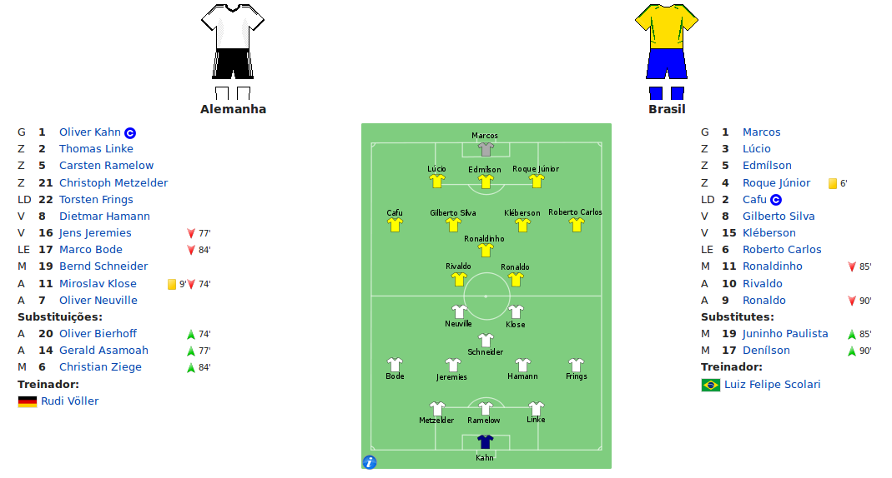
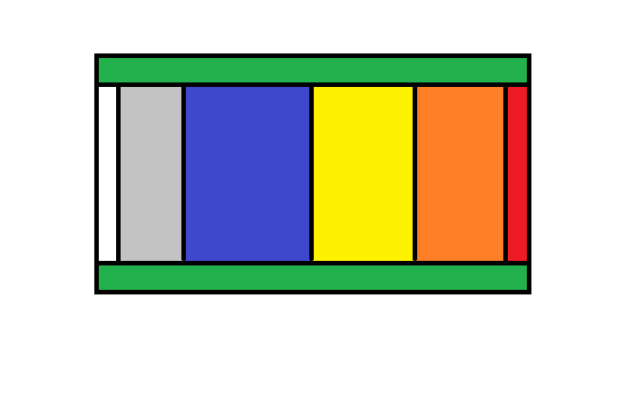

# 2002FIFAWorldCupFinal

## Trabalho 1 de Programação Concorrente 

O trabalho consiste no desenvolvimento de um algoritmo para tratar o problema proposto de comunicação entre processos através de uma memória compartilhada.

## Problema Proposto

O problema consiste na simulação de uma partida de futebol, mais especificamente a Final da Copa do Mundo FIFA 2002, entre Brasil e Alemanha.

## Formalizando o problema proposto

Em um jogo de futebol, cada time possui 11 jogadores titulares, e se baseando na formação **4-2-3-1** (utilizada pela Seleção Brasileira em 2002), onde cada time titular eh composto por:
  - 1 Goleiro;
  - 3 Zagueiros;
  - 2 Laterais;
  - 2 Volantes;
  - 1 Meia;
  - 2 Atacantes.
  

  
   
  <t>Figura 1: Times titulares de ambas as seleções</t>
   

Para fins de concorência, mais um jogador foi adicionado em cada posição, resultando no total de 17 jogadores, sendo eles definidos abaixo para cada time:

#### Escalação do Brasil (17 jogadores):
  - Goleiros: Marcos e Rogerio Ceni;
  - Zagueiros: Lucio, Edmilson, Roque Junior e Anderson Polga;
  - Laterais: Cafu, Roberto Carlos e Junior;
  - Volantes: Gilberto Silva, Kleberson e Vampeta;
  - Meias: Ronaldinho e Kaka;
  - Atacantes: Rivaldo, Ronaldo e Denilson.

#### Escalação da Alemanha (17 jogadores):
  - Goleiros: Kahn e Lehmann;
  - Zagueiros: Linke, Rehmer, Meltzfelder e Baumann;
  - Laterais: Frings, Bode e Ziege;
  - Volantes: Hamann, Jeremies e Ramelow;
  - Meias: Schneider e Ballack;
  - Atacantes: Klose, Neuville e Jancker.

A **primeira região crítica** é a designição do time titular, ou seja, os 17 processos concorrem entre si para ocupar uma vaga (em suas respectivas posições) no time que vai jogar a Final. 

A partida ocorre infinitamente, e os jogadores de cada time foram divididos em threads de acordo com suas posições, sendo elas:
  - Goleiro;
  - Zagueiro;
  - Lateral;
  - Volante;
  - Meia;
  - Atacante.

  
   
  <t>Figura 2: Divisão do campo de futebol em áreas para facilitar a implementação</t>
   

Para fins de fidedignidade do jogo, cada posição possui um conjunto de ações que podem ser realizadas e um pedaço do campo, sendo elas:
  - Goleiro (Gol de defesa, *em branco na Figura 2*)
    - Defender uma bola chutada em direção ao seu gol; 
    - Tocar a bola para um zagueiro de seu time.
  - Zagueiro (Defesa, *em cinza na Figura 2*)
    - Tomar a bola de um atacante adversário e toca-la para um zagueiro de seu time; 
    - Tocar a bola para um lateral de seu time.
  - Lateral (Lados, *em verde na Figura 2*)
    - Cruzar a bola para um atacante de seu time; 
    - Tocar a bola para um volante de seu time;
  - Volante (Meio Defensivo, *em azul na Figura 2*)
    - Tomar a bola de um meia adversário;
    - Tocar a bola para um meia de seu time;
  - Meia (Meio Ofensivo, *em amarelo na Figura 2*)
    - Chutar a bola em direção ao gol adversário;
    - Tocar a bola para um atacante de seu time;
  - Atacante (Ataque, *em laranja na Figura 2*)
    - Chutar a bola em direção ao gol adversário (*em vermelho na Figura 2*).

O time nunca passa a bola para trás, sempre passa para frente buscando o gol. 
 
A **segunda região crítica** implementada é a bola, pois entre os 22 processos ativos, somente 1 pode acessar a bola.

## Fontes
  - Escalação da Alemanha: http://www.dw.com/pt-br/titulares-da-seleção-alemã/a-514243
  - Escalação do Brasil: https://jogosdaselecaobrasileira.wordpress.com/2002/07/01/elenco-da-selecao-brasileira-na-copa-do-mundo-de-2002/
  - Final da Copa do Mundo FIFA 2002: https://pt.wikipedia.org/wiki/Final_da_Copa_do_Mundo_FIFA_de_2002
  - Teoria: http://www.cic.unb.br/~alchieri/
